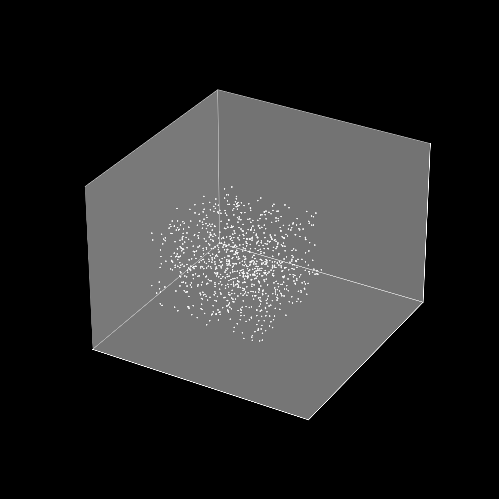

# N-Body Simulation
A high-performance N-Body simulation implemented in C++, designed to model the dynamics of particles under mutual gravitational interaction. This project provides a flexible framework for simulating astrophysical systems, including star clusters, galaxies, or general particle systems.

## Features

- Gravitational Computation: Implements the classical N-Body problem with force calculation and velocity verlet integration

- Energy monitoring: tracks total and relative energy drift to ensure physical accuracy (using verifier.py)

- High precision: Designed to minimize numerical errors and energy drift during long simulations.

- Visualzation-ready output: Outputs particle positions and velocities for further plotting and analysis (can be used by galaxy-demo.py for video output and visualizer3D.py for matplotlib animation)

**Note: to run the visualizer.py, verifier.py or galaxy_demo.py you must manually edit the number of particles in the script.**

## Getting Started

1. Clone the repository:
```
    https://github.com/ZiadAmr/N-Body-Simulation.git
```
2. Create bin directory
3. cd into bin directory
4. Run the following instructions:
```
    cmake -G "MinGW Makefiles" .. 
    cmake --build .
```

## How to run it

While inside `bin` directory run the `nbody.exe` with the following command line arguments:

```
    .\nbody.exe [-n numParticles] [-dt timestep] [-i iterations] [-l cube] [-ms mapsize] [-v0 init_vel]
```

The arguments for `-dt` `-l` -`ms` and `v0` must be positive numbers but they can be non-integers, while `-n` must be an integer

The arguments for -l are regarding the initilization of the simulation, the only option right now is `cube` which randomly generates the objects within a cube of size `ms`.

## Showcase



Below is output from `galaxy_demo_pyvis.py` for 1 thousand particles over 2000 timesteps.

https://github.com/user-attachments/assets/6bb998d4-ef7c-43fd-bf92-3e9ef505f9fa

1 thousand particles, with random coordinates in a 5x5 cube, all objects have mass one and initial speed between -0.1 and 0.1. This system exhibits a violent collapse behaviour.

## Future Extensions

- Implement Barnes-Hut algorithm for improved performance on large particle counts
- Add collision detection and merging for astrophysical realism 
