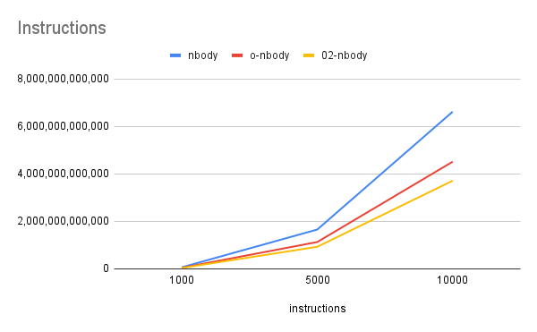

# Performance
This file details the changes in perfomance of the application over the development phase with the following test conditions using the perf tool:

Test 1:
- 

<!-- sudo perf stat -d ./nbody -n 1000 -i 2000 -l plummer -->
<!-- sudo perf record -F 999 -g ./nbody -n 1000 -i 2000 -l plummer  -->

M = 1 for all particles

plummer sphere

N = 1000

2000 timesteps

dt = 0.0005

call with flags `-O3 -g` for compiler performance optimization and profiling

Test 2
-
M = 1 for all particles

plummer sphere

N = 5000

2000 timesteps

dt = 0.0005

call with flags `-O3 -g` for compiler performance optimization and profiling

Test 3:
- 
M = 1 for all particles

plummer sphere

N = 10000

2000 timesteps

dt = 0.0005

call with flags `-O3 -g` for compiler performance optimization and profiling

## Naive Implementation


brute force implementation, no optimizations (except for batching the file writes at the end to reduce system calls)

Test 1: `nbody -n 1000 -i 2000`

- seconds elapsed: 8.075
- seconds user: 6.203
- second sys: 0.065
- 98.37% in `updateAcc`

| Name                    | Measurement   |
|-------------------------|---------------|
| task-clock              | 6,268,130,645 (0.74 CPUs utilized) |
| context-switches        | 109           |
| cpu-migrations          | 38            |
| page-faults             | 40,187         |
| instructions            | 66,828,749,162   |
| cycles                  | 29,833,369,982   |
| stalled-cycles-frontend | 305,551,588 (1.10% )   |
| branches                | 6,120,745,506    |
| branch-misses           | 18,400,425  (0.32%)    |
| L1-dcache-loads         | 22,404,177,280   |
| L1-dcache-load-misses   | 260,628,673 (1.24%)    |

2.24 insn per cycle

<!--
 Performance counter stats for './nbody -n 1000 -i 2000 -l plummer':

     6,214,099,919      task-clock                       #    0.774 CPUs utilized             
                91      context-switches                 #   14.644 /sec                      
                16      cpu-migrations                   #    2.575 /sec                      
            40,187      page-faults                      #    6.467 K/sec                     
    66,805,475,114      instructions                     #    2.24  insn per cycle            
                                                  #    0.00  stalled cycles per insn     (71.41%)
    29,859,543,339      cycles                           #    4.805 GHz                         (71.42%)
       327,341,662      stalled-cycles-frontend          #    1.10% frontend cycles idle        (71.42%)
     6,121,031,432      branches                         #  985.023 M/sec                       (71.44%)
        19,393,541      branch-misses                    #    0.32% of all branches             (71.46%)
    22,420,433,782      L1-dcache-loads                  #    3.608 G/sec                       (71.44%)
       279,125,063      L1-dcache-load-misses            #    1.24% of all L1-dcache accesses   (71.41%)

       8.024819774 seconds time elapsed

       6.139501000 seconds user
       0.075018000 seconds sys
-->

Test 2: `nbody -n 5000 -i 2000`

- seconds elapsed: 163.962
- seconds user: 154.414
- second sys: 0.441
- 99.36% in `updateAcc`

| Name                    | Measurement   |
|-------------------------|---------------|
| task-clock              | 154,857,011,823 (0.944 CPUs utilized) |
| context-switches        | 1,543          |
| cpu-migrations          | 141           |
| page-faults             | 261,776         |
| instructions            | 1,657,322,051,504   |
| cycles                  | 737,053,040,065  |
| stalled-cycles-frontend | 3,269,987,073  (0.44%)  |
| branches                | 151,118,584,757    |
| branch-misses           | 148,504,002  (0.10%)  |
| L1-dcache-loads         | 553,037,464,106  |
| L1-dcache-load-misses   | 25,304,740,004 (4.58%)     |

2.25 insn per cycle

<!-- 
 Performance counter stats for './nbody -n 5000 -i 2000 -l plummer':

   154,857,011,823      task-clock                       #    0.944 CPUs utilized             
             1,543      context-switches                 #    9.964 /sec                      
               141      cpu-migrations                   #    0.911 /sec                      
           261,776      page-faults                      #    1.690 K/sec                     
 1,657,322,051,504      instructions                     #    2.25  insn per cycle            
                                                  #    0.00  stalled cycles per insn     (71.43%)
   737,053,040,065      cycles                           #    4.760 GHz                         (71.43%)
     3,269,987,073      stalled-cycles-frontend          #    0.44% frontend cycles idle        (71.43%)
   151,118,584,757      branches                         #  975.859 M/sec                       (71.43%)
       148,504,002      branch-misses                    #    0.10% of all branches             (71.43%)
   553,037,464,106      L1-dcache-loads                  #    3.571 G/sec                       (71.43%)
    25,304,740,004      L1-dcache-load-misses            #    4.58% of all L1-dcache accesses   (71.43%)

     163.962093237 seconds time elapsed

     154.414351000 seconds user
       0.441203000 seconds sys
 -->

Test 3: `nbody -n 10000 -i 2000`
- seconds elapsed: 648.533
- seconds user: 628.679
- second sys: 0.874
- 99.50% in `updateAcc`

| Name                    | Measurement   |
|-------------------------|---------------|
| task-clock              | 629,563,644,327  (0.971 CPU utilized) |
| context-switches        | 7,541          |
| cpu-migrations          | 1,336          |
| page-faults             | 523,395        |
| instructions            | 6,621,930,731,397   |
| cycles                  | 2,945,020,964,366  |
| stalled-cycles-frontend | 10,704,554,360 (0.36%)   |
| branches                | 603,417,424,393    |
| branch-misses           | 421,692,295   (0.07%)  |
| L1-dcache-loads         | 2,208,228,038,470 |
| L1-dcache-load-misses   | 101,288,792,810 (4.59%)     |

2.25 insn per cycle

<!-- 
 Performance counter stats for './nbody -n 10000 -i 2000 -l plummer':

   629,563,644,327      task-clock                       #    0.971 CPUs utilized             
             7,541      context-switches                 #   11.978 /sec                      
             1,336      cpu-migrations                   #    2.122 /sec                      
           523,395      page-faults                      #  831.362 /sec                      
 6,621,930,731,397      instructions                     #    2.25  insn per cycle            
                                                  #    0.00  stalled cycles per insn     (71.43%)
 2,945,020,964,366      cycles                           #    4.678 GHz                         (71.43%)
    10,704,554,360      stalled-cycles-frontend          #    0.36% frontend cycles idle        (71.43%)
   603,417,424,393      branches                         #  958.469 M/sec                       (71.43%)
       421,692,295      branch-misses                    #    0.07% of all branches             (71.43%)
 2,208,228,038,470      L1-dcache-loads                  #    3.508 G/sec                       (71.43%)
   101,288,792,810      L1-dcache-load-misses            #    4.59% of all L1-dcache accesses   (71.43%)

     648.533665802 seconds time elapsed

     628.679401000 seconds user
       0.874018000 seconds sys
 -->

## Naive implementation w/ Optimized force calculation (o-nbody)

Brute force implementation, exploiting the symmetry in the force calculation:

rather than calculating forces for 

```
    for i in n:
        for j in n:
```

we do:

```
    for i in n:
        for j > i in n:
```

Test 1: `nbody -n 1000 -i 2000`
- seconds elapsed: 5.959
- seconds user: 3.931
- seconds sys: 0.1
- 97.96% in `updateAcc2`

| Name                    | Measurement   |
|-------------------------|---------------|
| task-clock              | 4,031,250,441  (0.676 CPU utilized) |
| context-switches        | 88           |
| cpu-migrations          | 6         |
| page-faults             | 40,185       |
| instructions            | 45,795,954,887   |
| cycles                  | 19,941,241,813  |
| stalled-cycles-frontend | 307,073,461 (1.54%)   |
| branches                | 2,130,274,778    |
| branch-misses           | 13,091,281  (0.61%)  |
| L1-dcache-loads         | 17,366,467,031 |
| L1-dcache-load-misses   | 611,355,425 (3.52%)     |

2.30 insn per cycle


<!-- 
 Performance counter stats for './nbody -n 1000 -i 2000 -l plummer':

     4,031,250,441      task-clock                       #    0.676 CPUs utilized             
                88      context-switches                 #   21.829 /sec                      
                 6      cpu-migrations                   #    1.488 /sec                      
            40,185      page-faults                      #    9.968 K/sec                     
    45,795,954,887      instructions                     #    2.30  insn per cycle            
                                                  #    0.01  stalled cycles per insn     (71.43%)
    19,941,241,813      cycles                           #    4.947 GHz                         (71.40%)
       307,073,461      stalled-cycles-frontend          #    1.54% frontend cycles idle        (71.42%)
     2,130,274,778      branches                         #  528.440 M/sec                       (71.42%)
        13,091,281      branch-misses                    #    0.61% of all branches             (71.43%)
    17,366,467,031      L1-dcache-loads                  #    4.308 G/sec                       (71.46%)
       611,355,425      L1-dcache-load-misses            #    3.52% of all L1-dcache accesses   (71.45%)

       5.959369217 seconds time elapsed

       3.930731000 seconds user
       0.100993000 seconds sys
-->

Test 2: `nbody -n 5000 -i 2000`
- seconds elapsed: 106.935
- seconds user: 96.935
- seconds sys: 0.41
- 99.16% in `updateAcc2`

| Name                    | Measurement   |
|-------------------------|---------------|
| task-clock              | 97,346,868,404  (0.913CPU utilized) |
| context-switches        | 1,320          |
| cpu-migrations          | 276         |
| page-faults             | 261,773       |
| instructions            | 1,130,477,645,097   |
| cycles                  | 488,360,111,455   |
| stalled-cycles-frontend | 2,431,809,471 (0.50%)   |
| branches                | 50,868,465,033   |
| branch-misses           | 191,977,740  (0.18%)  |
| L1-dcache-loads         | 427,458,382,842  |
| L1-dcache-load-misses   | 22,041,827,729 (5.16%)     |

2.31 insn per cycle

5.16% cache miss rate is concerning

<!-- 
 Performance counter stats for './nbody -n 5000 -i 2000 -l plummer':

    97,346,868,404      task-clock                       #    0.913 CPUs utilized             
             1,320      context-switches                 #   13.560 /sec                      
               276      cpu-migrations                   #    2.835 /sec                      
           261,773      page-faults                      #    2.689 K/sec                     
 1,130,477,645,097      instructions                     #    2.31  insn per cycle            
                                                  #    0.00  stalled cycles per insn     (71.43%)
   488,360,111,455      cycles                           #    5.017 GHz                         (71.43%)
     2,431,809,471      stalled-cycles-frontend          #    0.50% frontend cycles idle        (71.43%)
    50,868,465,033      branches                         #  522.549 M/sec                       (71.43%)
        91,977,740      branch-misses                    #    0.18% of all branches             (71.43%)
   427,458,382,842      L1-dcache-loads                  #    4.391 G/sec                       (71.43%)
    22,041,827,729      L1-dcache-load-misses            #    5.16% of all L1-dcache accesses   (71.42%)

     106.618224655 seconds time elapsed

      96.935801000 seconds user
       0.410761000 seconds sys
-->

Test 3: `nbody -n 10000 -i 2000`
- seconds elapsed: 407.043
- seconds user: 387.813
- seconds sys: 0.882

| Name                    | Measurement   |
|-------------------------|---------------|
| task-clock              | 388,697,891,980   (0.955 CPU utilized) |
| context-switches        | 5,346           |
| cpu-migrations          | 1,352        |
| page-faults             | 523,400       |
| instructions            | 4,515,537,265,957    |
| cycles                  | 1,949,991,624,781  |
| stalled-cycles-frontend | 7,586,346,631 (0.39%)   |
| branches                | 202,444,836,085 |
| branch-misses           | 261,752,003   (0.13%)  |
| L1-dcache-loads         | 1,706,713,424,896  |
| L1-dcache-load-misses   | 88,829,809,900 (5.20%)     |

2.32 insn per cycle

<!-- 
 Performance counter stats for './nbody -n 10000 -i 2000 -l plummer':

   388,697,891,980      task-clock                       #    0.955 CPUs utilized             
             5,346      context-switches                 #   13.754 /sec                      
             1,352      cpu-migrations                   #    3.478 /sec                      
           523,400      page-faults                      #    1.347 K/sec                     
 4,515,537,265,957      instructions                     #    2.32  insn per cycle            
                                                  #    0.00  stalled cycles per insn     (71.43%)
 1,949,991,624,781      cycles                           #    5.017 GHz                         (71.43%)
     7,586,346,631      stalled-cycles-frontend          #    0.39% frontend cycles idle        (71.43%)
   202,444,836,085      branches                         #  520.828 M/sec                       (71.43%)
       261,752,003      branch-misses                    #    0.13% of all branches             (71.43%)
 1,706,713,424,896      L1-dcache-loads                  #    4.391 G/sec                       (71.43%)
    88,829,809,900      L1-dcache-load-misses            #    5.20% of all L1-dcache accesses   (71.43%)

     407.043615933 seconds time elapsed

     387.813269000 seconds user
       0.882075000 seconds sys

-->

## Naive implementation w/ Optimized force calculation and less memory writes (02-nbody)

Optimization to improve memory locality

Test 1: `nbody -n 1000 -i 2000`
- seconds elapsed: 5.301
- seconds user: 3.511
- seconds sys: 0.097
- 97.63% in `updateAcc3`

| Name                    | Measurement   |
|-------------------------|---------------|
| task-clock              | 3,608,965,156    (0.681 CPU utilized) |
| context-switches        | 64           |
| cpu-migrations          | 13       |
| page-faults             | 40,185      |
| instructions            | 37,820,728,665    |
| cycles                  | 17,884,445,932  |
| stalled-cycles-frontend | 306,070,798 (1.71%)   |
| branches                | 2,128,289,515 |
| branch-misses           | 12,918,480  (0.61%)  |
| L1-dcache-loads         | 14,360,191,797  |
| L1-dcache-load-misses   | 612,369,117 (4.26%)     |

2.11 insn per cycle

<!-- 
 Performance counter stats for './nbody -n 1000 -i 2000 -l plummer':

     3,608,965,156      task-clock                       #    0.681 CPUs utilized             
                64      context-switches                 #   17.734 /sec                      
                13      cpu-migrations                   #    3.602 /sec                      
            40,185      page-faults                      #   11.135 K/sec                     
    37,820,728,665      instructions                     #    2.11  insn per cycle            
                                                  #    0.01  stalled cycles per insn     (71.39%)
    17,884,445,932      cycles                           #    4.956 GHz                         (71.36%)
       306,070,798      stalled-cycles-frontend          #    1.71% frontend cycles idle        (71.43%)
     2,128,289,515      branches                         #  589.723 M/sec                       (71.48%)
        12,918,480      branch-misses                    #    0.61% of all branches             (71.46%)
    14,360,191,797      L1-dcache-loads                  #    3.979 G/sec                       (71.44%)
       612,369,117      L1-dcache-load-misses            #    4.26% of all L1-dcache accesses   (71.43%)

       5.300972542 seconds time elapsed

       3.511560000 seconds user
       0.097857000 seconds sys

-->

Test 2: `nbody -n 5000 -i 2000`
- seconds elapsed: 96.298
- seconds user: 86.652
- seconds sys: 0.433
- 99.02% in `updateAcc3`

| Name                    | Measurement   |
|-------------------------|---------------|
| task-clock              | 87,086,947,765   (0.904 CPU utilized) |
| context-switches        | 1,257           |
| cpu-migrations          | 287       |
| page-faults             | 261,777     |
| instructions            | 930,314,182,054   |
| cycles                  | 436,593,930,682 |
| stalled-cycles-frontend | 2,396,424,250 (0.55%)   |
| branches                | 50,839,152,080 |
| branch-misses           | 88,912,727   (0.17%)  |
| L1-dcache-loads         | 352,515,995,818 |
| L1-dcache-load-misses   | 22,090,166,749  (6.27%)     |

2.13 insn per cycle

<!-- 
 Performance counter stats for './nbody -n 5000 -i 2000 -l plummer':

    87,086,947,765      task-clock                       #    0.904 CPUs utilized             
             1,257      context-switches                 #   14.434 /sec                      
               287      cpu-migrations                   #    3.296 /sec                      
           261,777      page-faults                      #    3.006 K/sec                     
   930,314,182,054      instructions                     #    2.13  insn per cycle            
                                                  #    0.00  stalled cycles per insn     (71.43%)
   436,593,930,682      cycles                           #    5.013 GHz                         (71.43%)
     2,396,424,250      stalled-cycles-frontend          #    0.55% frontend cycles idle        (71.43%)
    50,839,152,080      branches                         #  583.775 M/sec                       (71.43%)
        88,912,727      branch-misses                    #    0.17% of all branches             (71.43%)
   352,515,995,818      L1-dcache-loads                  #    4.048 G/sec                       (71.42%)
    22,090,166,749      L1-dcache-load-misses            #    6.27% of all L1-dcache accesses   (71.43%)

      96.298073158 seconds time elapsed

      86.652458000 seconds user
       0.433855000 seconds sys
 -->

Test 3: `nbody -n 10000 -i 2000`
- seconds elapsed: 365.180
- seconds user: 345.593
- seconds sys: 0.869
- 99.40% in `updateAcc3`

| Name                    | Measurement   |
|-------------------------|---------------|
| task-clock              | 346,467,229,874    (0.949 CPU utilized) |
| context-switches        | 4,816           |
| cpu-migrations          | 1,101       |
| page-faults             | 523,399     |
| instructions            | 3,714,796,762,225   |
| cycles                  | 1,739,149,617,873  |
| stalled-cycles-frontend | 7,153,172,588 (0.41%)   |
| branches                | 202,311,458,920|
| branch-misses           | 248,027,993    (0.12%)  |
| L1-dcache-loads         | 1,406,596,023,341 |
| L1-dcache-load-misses   | 88,457,000,521 (6.29%)     |

2.14 insn per cycle


<!--  1,706,713,424,896 / 1,406,596,023,341 vs 88,829,809,900  / 88,457,000,521 -->
<!-- 
 Performance counter stats for './nbody -n 10000 -i 2000 -l plummer':

   346,467,229,874      task-clock                       #    0.949 CPUs utilized             
             4,816      context-switches                 #   13.900 /sec                      
             1,101      cpu-migrations                   #    3.178 /sec                      
           523,399      page-faults                      #    1.511 K/sec                     
 3,714,796,762,225      instructions                     #    2.14  insn per cycle            
                                                  #    0.00  stalled cycles per insn     (71.43%)
 1,739,149,617,873      cycles                           #    5.020 GHz                         (71.43%)
     7,153,172,588      stalled-cycles-frontend          #    0.41% frontend cycles idle        (71.43%)
   202,311,458,920      branches                         #  583.927 M/sec                       (71.43%)
       248,027,993      branch-misses                    #    0.12% of all branches             (71.43%)
 1,406,596,023,341      L1-dcache-loads                  #    4.060 G/sec                       (71.43%)
    88,457,000,521      L1-dcache-load-misses            #    6.29% of all L1-dcache accesses   (71.43%)

     365.180530198 seconds time elapsed

     345.593602000 seconds user
       0.869071000 seconds sys
-->

## Barnes-Hut Implementation

# Aggregation

Comparing between the base n-body simulation and with the optimized force calculation. The Instructions are reduced, from 6,268,130,645 to 4,031,250,441 at 1000 particles. The number of instructions increases at the same rate meaning that the optimized calculation results in fewer instructions.

However, the downside of this optimization method is that it increases the percentage of stalled cycles, branch misses, and L1 cache misses. The decrease in instructions offsets this difference and leads to improved performance. This leads to an improvement in performance, where the performance improvement factor increases with number of particles. 

This increase in stalled cycles, branch misses, and L1 cache misses is a result of more scattered writes, more complex control flow, worse memory locality and harder vectorization. 

This observation lead us to implement o2-nbody, which reduced the number of memory access. This may lead to a higher percentage of cache misses, but the number of misses remains the same. This leads to a small but noticeable improvement in performance.





